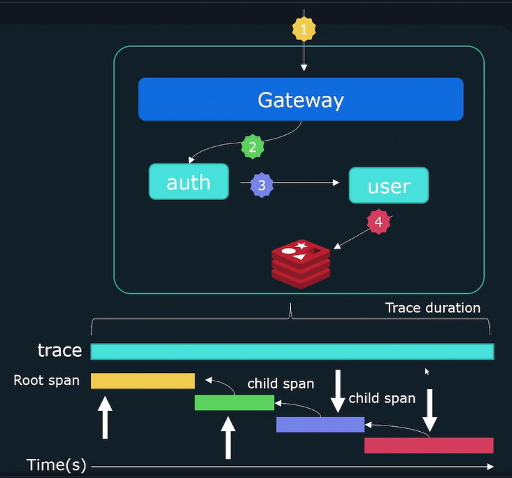

# Prometheus

## Observability

Observability is the ability to understand and measure the internal state of a system based on the data it generates. It enables you to derive actionable insights from unexpected behaviors in dynamic environments.

---

### Purpose

The primary goal of observability is to gain a deep understanding of the internal workings of a system.

---

### Troubleshooting with Observability

Effective troubleshooting goes beyond identifying *what* went wrong. It helps answer:

* **Why** did the application enter a specific state?
* **What** component is responsible?
* **How** can we prevent it in the future?

---

### Fundamentals of Observability

#### The Three Pillars of Observability

1. **Logging**
2. **Metrics**
3. **Tracing**

---

#### Logs

Logs are time-stamped records of discrete events within a system.

**Logs typically include:**

* A **timestamp** indicating when the event occurred.
* A **message** describing the event.

Logs from concurrent systems can be interleaved and distributed across different components.

---

#### Traces

Traces help follow a request as it traverses through various services, providing a holistic view of its journey—hop by hop.

**Components of a trace:**

* **Trace ID**: Identifies the entire request lifecycle.
* **Spans**: Individual units of work within the trace.

Each **span** includes:

* **Start time**
* **Duration**
* **Parent Span ID**

> 

---

#### Metrics

Metrics represent quantitative data points that reflect the system’s state.

**Examples:**

* CPU load
* Number of open files
* HTTP response times
* Error rates

Metrics are often visualized over time to uncover trends and anomalies.

**A metric consists of:**

1. **Metric Name**
2. **Value** (current or recent)
3. **Timestamp**
4. **Dimensions** (contextual metadata)

---

### SLO / SLA / SLI Explained

#### SLI (Service Level Indicator)

A quantifiable measure of service performance.

**Examples:**

* Request latency
* Error rate
* Throughput
* Availability
* Resource saturation

> Not all metrics make good SLIs; the focus should be on those that reflect **user experience**.

---

#### SLO (Service Level Objective)

A target or acceptable range for an SLI. It is a promise about the expected performance level.

**Examples:**

* **Latency SLO**: Response time < 100 ms
* **Availability SLO**: 99.9% uptime

> SLOs are defined from the **customer’s perspective**.

---

#### SLA (Service Level Agreement)

A formal agreement between a service provider and a user that enforces a specific SLO.

* May include **financial** or **contractual** consequences if targets are not met.

---

## Prometheus Fundamentals

### Overview

1. **Prometheus** is an open-source monitoring system for collecting and querying metrics data.
2. It supports **alerting** based on metric thresholds.
3. Prometheus **scrapes** metrics from configured targets via an HTTP endpoint.
4. Scraped data is stored in a **time-series database** and queried using **PromQL** (Prometheus Query Language).

Prometheus is designed to monitor **numeric time-series data**, such as:

* Events
* System Logs
* Traces

---

### Prometheus Architecture

The main server consists of three core components:

* **Retrieval**: Scrapes metric data.
* **Time-Series Database**: Stores the metric data.
* **HTTP Server**: Handles PromQL queries.

Additional components include:

1. **Exporters**: Lightweight processes that run on the target system to expose metrics. Prometheus pulls this data; targets never push it.
2. **PushGateway**: Used for short-lived jobs that can’t be scraped in time. Jobs push metrics to PushGateway, and Prometheus pulls from it.
3. **Service Discovery**: Dynamically provides a list of targets to scrape, avoiding the need for hardcoded target lists.
4. **AlertManager**: Receives alerts triggered by Prometheus and handles notifications via SMS, email, or SMTP.
5. **PromQL**: The query language used by visualization tools to fetch data for dashboards.

---

### Collecting Metrics

Prometheus collects metrics by sending HTTP requests to the `/metrics` endpoint of target clients. This path can be configured based on specific setups.

---

### Exporters

Many systems don’t expose metrics natively. **Exporters** gather system metrics and expose them in a format that Prometheus can understand.

**Popular exporters include:**

1. Node Exporter (Linux servers)
2. Windows Exporter
3. MySQL Exporter
4. Apache Exporter
5. HAProxy Exporter

---

### Client Libraries

Exporters are not suitable for custom applications. For these, Prometheus provides **client libraries** that developers can use to expose custom application metrics.

**Official client libraries are available for most major programming languages.**

---

### Push vs Pull

#### Pull-Based Model

In this model, Prometheus is responsible for scraping metrics from all target systems.

**Benefits:**

1. Easier to detect when a target is **down**; in a push model, it’s unclear if a system is down or intentionally offline.
2. Prevents overload on the metrics server, as Prometheus controls the scraping frequency.
3. Maintains a **centralized list of monitored targets**, establishing a clear source of truth.

#### Push-Based Model

In the push model, targets are configured to **send** their metrics to the metrics server.

**Best suited for:**

* **Event-based systems**, where pulling metrics is not feasible due to short job durations or dynamic instances.

---

### Installing Prometheus

Below are the steps to install Prometheus on a Linux system.

#### Step 1: Extract the Prometheus Archive

```bash
tar -xvf prometheus-{version}.linux-amd64.tar.gz
```

#### Step 2: Create a Dedicated User for Prometheus

```bash
sudo useradd --no-create-home --shell /bin/false prometheus
```

#### Step 3: Create Necessary Directories

```bash
sudo mkdir /var/lib/prometheus /etc/prometheus
```

#### Step 4: Set Ownership

```bash
sudo chown prometheus: /etc/prometheus /var/lib/prometheus/
```

#### Step 5: Move Binaries to System Path

```bash
sudo mv prometheus promtool /usr/local/bin/
sudo chown prometheus: /usr/local/bin/prometheus /usr/local/bin/promtool
```

#### Step 6: Move Configuration Files

```bash
sudo mv consoles console_libraries prometheus.yml /etc/prometheus/
sudo chown -R prometheus: /etc/prometheus/*
```

#### Step 7: Create a Systemd Service File

```bash
sudo nano /etc/systemd/system/prometheus.service
```

Paste the following content:

```ini
[Unit]
Description=Prometheus
Wants=network-online.target
After=network-online.target

[Service]
User=prometheus
Group=prometheus
Type=simple
ExecStart=/usr/local/bin/prometheus \
        --config.file=/etc/prometheus/prometheus.yml \
        --storage.tsdb.path=/var/lib/prometheus/ \
        --web.console.templates=/etc/prometheus/consoles \
        --web.console.libraries=/etc/prometheus/console_libraries

[Install]
WantedBy=multi-user.target
```

#### Step 8: Reload Systemd and Start Prometheus

```bash
sudo systemctl daemon-reload
sudo systemctl enable prometheus
sudo systemctl start prometheus
```

#### Step 9: Check Prometheus Status

```bash
sudo systemctl status prometheus
```

This completes the Prometheus installation and configuration process.

---

### Installing Node Exporter

Node Exporter is used to expose hardware and OS metrics from \*nix systems.

#### Step 1: Extract the Node Exporter Archive

```bash
tar -xvf node_exporter-{version}.linux-amd64.tar.gz
cd node_exporter-{version}.linux-amd64/
```

#### Step 2: Create a Dedicated User for Node Exporter

```bash
sudo useradd --no-create-home --shell /bin/false node_exporter
```

#### Step 3: Move Binary to System Path

```bash
sudo mv node_exporter /usr/local/bin
sudo chown node_exporter: /usr/local/bin/node_exporter
```

#### Step 4: Create a Systemd Service File

```bash
sudo nano /etc/systemd/system/node_exporter.service
```

Paste the following content:

```ini
[Unit]
Description=Node Exporter
Wants=network-online.target
After=network-online.target

[Service]
User=node_exporter
Group=node_exporter
Type=simple
ExecStart=/usr/local/bin/node_exporter

[Install]
WantedBy=multi-user.target
```

#### Step 5: Reload Systemd and Start Node Exporter

```bash
sudo systemctl daemon-reload
sudo systemctl start node_exporter
sudo systemctl enable node_exporter
```

#### Step 6: Verify Node Exporter is Running

You can verify by visiting the following URL:

```bash
curl http://localhost:9100/metrics
```

This confirms that Node Exporter is running and exposing metrics on port `9100`.

### Prometheus Configuration

- **global**  
  Default parameters for all config sections.

- **scrape_configs**  
  Define targets and configs for metrics collection.

- **job_name**  
  A collection of instances that need to be scraped.

- **job_configs**  
  Configs for scrape job. Takes precedence over global_configs.

- **targets**  
  Set of targets to scrape.

```yaml
scrape_configs:
  # How frequently to scrape targets from this job.
  [ scrape_interval: <duration> | default = <global_config.scrape_interval> ]
  
  # Per-scrape timeout when scraping this job.
  [ scrape_timeout: <duration> | default = <global_config.scrape_timeout> ]
  
  # The HTTP resource path on which to fetch metrics from targets.
  [ metrics_path: <path> | default = /metrics ]
  
  # Configures the protocol scheme used for requests.
  [ scheme: <scheme> | default = http ]
  
  # Sets the Authorization header on every scrape request with the 
  # configured username and password.
  # password and password_file are mutually exclusive.
  basic_auth:
    [ username: <string> ]
    [ password: <secret> ]
    [ password_file: <string> ]
```

### Authentication & Encryption

#### Authentication

```bash
sudo openssl req -new -newkey rsa:2048 -days 365 -nodes -x509 \
  -keyout node_exporter.key -out node_exporter.crt \
  -subj "/C=IN/ST=WestBengal/L=Kolkata/O=MyOrg/CN=localhost" \
  -addext "subjectAltName = DNS:localhost"

sudo mkdir /etc/node_exporter
sudo mv node_exporter.* /etc/node_exporter
sudo mv /etc/node_exporter/config.yml
```

```yml
# /etc/node_exporter/config.yml
tls_server_config:
  cert_file: node_exporter.crt
  key_file: node_exporter.key
```

```bash
sudo chown node_exporter: /etc/node_exporter/*
sudo nano /etc/systemd/system/node_exporter.service
# Update this line:
# ExecStart=/usr/local/bin/node_exporter --web.config.file=/etc/node_exporter/config.yml

sudo systemctl daemon-reexec
sudo systemctl daemon-reload
sudo systemctl restart node_exporter

curl -k http://localhost:9100/metrics

cd /etc/node_exporter/ && sudo cp node_exporter.crt /etc/prometheus/
cd /etc/prometheus/ && sudo chown prometheus: node_exporter.crt
```

Update the `node` scrape\_configs in Prometheus:

```yml
- job_name: "node"
  scheme: https
  tls_config:
    ca_file: /etc/prometheus/node_exporter.crt
    insecure_skip_verify: true
  static_configs:
    - targets: ["localhost:9100"]
```

```bash
sudo systemctl restart prometheus
```

#### Encryption

```bash
sudo apt install apache2-utils
htpasswd -nBC 12 "" | tr -d ':\n'
sudo nano /etc/node_exporter/config.yml
```

```yml
basic_auth_users:
  prometheus: <--bcrypt-hashed-pwd-->
```

```bash
sudo systemctl restart node_exporter
sudo nano /etc/prometheus/prometheus.yml
```

```yml
- job_name: "node"
  scheme: https
  basic_auth:
    username: prometheus
    password: <--plain-text-pwd-->
```
