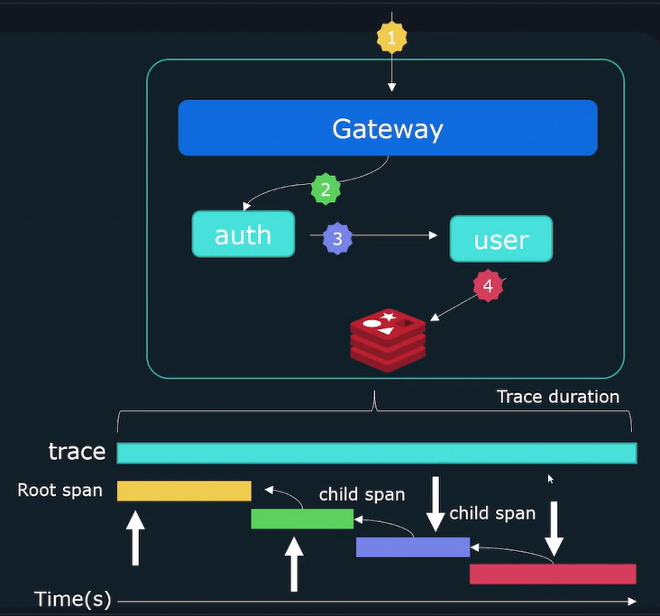
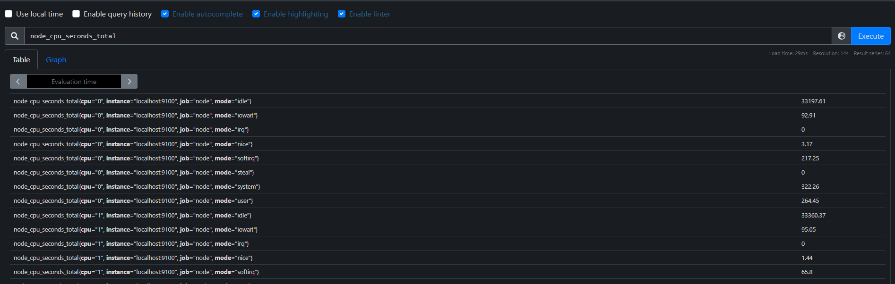
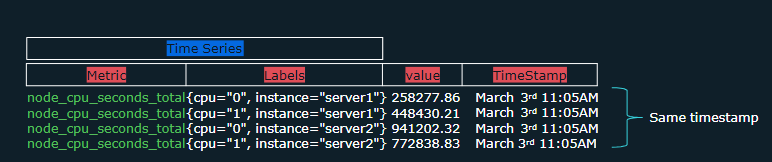
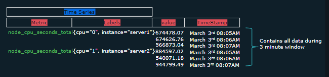
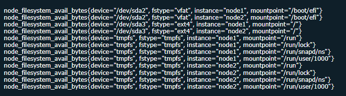
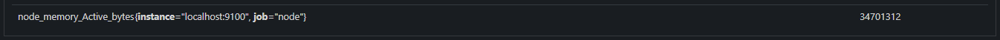
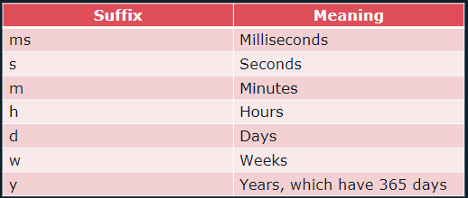
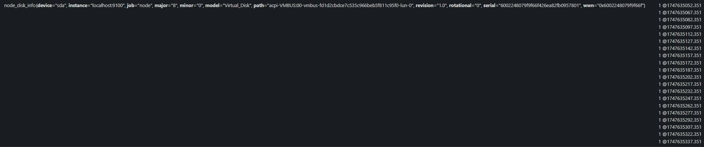
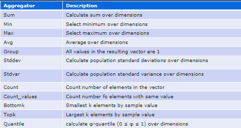
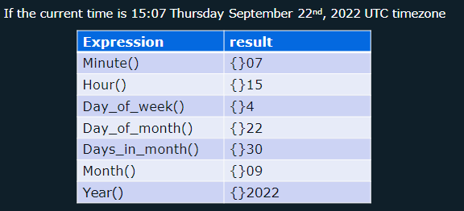

# Prometheus

## Observability

Observability is the ability to understand and measure the internal state of a system based on the data it generates. It enables you to derive actionable insights from unexpected behaviors in dynamic environments.

---

### Purpose

The primary goal of observability is to gain a deep understanding of the internal workings of a system.

---

### Troubleshooting with Observability

Effective troubleshooting goes beyond identifying *what* went wrong. It helps answer:

* **Why** did the application enter a specific state?
* **What** component is responsible?
* **How** can we prevent it in the future?

---

### Fundamentals of Observability

#### The Three Pillars of Observability

1. **Logging**
2. **Metrics**
3. **Tracing**

---

#### Logs

Logs are time-stamped records of discrete events within a system.

**Logs typically include:**

* A **timestamp** indicating when the event occurred.
* A **message** describing the event.

Logs from concurrent systems can be interleaved and distributed across different components.

---

#### Traces

Traces help follow a request as it traverses through various services, providing a holistic view of its journey—hop by hop.

**Components of a trace:**

* **Trace ID**: Identifies the entire request lifecycle.
* **Spans**: Individual units of work within the trace.

Each **span** includes:

* **Start time**
* **Duration**
* **Parent Span ID**

> 

---

#### Metrics Definition

Metrics represent quantitative data points that reflect the system’s state.

**Examples:**

* CPU load
* Number of open files
* HTTP response times
* Error rates

Metrics are often visualized over time to uncover trends and anomalies.

**A metric consists of:**

1. **Metric Name**
2. **Value** (current or recent)
3. **Timestamp**
4. **Dimensions** (contextual metadata)

---

### SLO / SLA / SLI Explained

#### SLI (Service Level Indicator)

A quantifiable measure of service performance.

**Examples:**

* Request latency
* Error rate
* Throughput
* Availability
* Resource saturation

> Not all metrics make good SLIs; the focus should be on those that reflect **user experience**.

---

#### SLO (Service Level Objective)

A target or acceptable range for an SLI. It is a promise about the expected performance level.

**Examples:**

* **Latency SLO**: Response time < 100 ms
* **Availability SLO**: 99.9% uptime

> SLOs are defined from the **customer’s perspective**.

---

#### SLA (Service Level Agreement)

A formal agreement between a service provider and a user that enforces a specific SLO.

* May include **financial** or **contractual** consequences if targets are not met.

---

## Prometheus Fundamentals

### Overview

1. **Prometheus** is an open-source monitoring system for collecting and querying metrics data.
2. It supports **alerting** based on metric thresholds.
3. Prometheus **scrapes** metrics from configured targets via an HTTP endpoint.
4. Scraped data is stored in a **time-series database** and queried using **PromQL** (Prometheus Query Language).

Prometheus is designed to monitor **numeric time-series data**, such as:

* Events
* System Logs
* Traces

---

### Prometheus Architecture

The main server consists of three core components:

* **Retrieval**: Scrapes metric data.
* **Time-Series Database**: Stores the metric data.
* **HTTP Server**: Handles PromQL queries.

Additional components include:

1. **Exporters**: Lightweight processes that run on the target system to expose metrics. Prometheus pulls this data; targets never push it.
2. **PushGateway**: Used for short-lived jobs that can’t be scraped in time. Jobs push metrics to PushGateway, and Prometheus pulls from it.
3. **Service Discovery**: Dynamically provides a list of targets to scrape, avoiding the need for hardcoded target lists.
4. **AlertManager**: Receives alerts triggered by Prometheus and handles notifications via SMS, email, or SMTP.
5. **PromQL**: The query language used by visualization tools to fetch data for dashboards.

---

### Collecting Metrics

Prometheus collects metrics by sending HTTP requests to the `/metrics` endpoint of target clients. This path can be configured based on specific setups.

---

### Exporters

Many systems don’t expose metrics natively. **Exporters** gather system metrics and expose them in a format that Prometheus can understand.

**Popular exporters include:**

1. Node Exporter (Linux servers)
2. Windows Exporter
3. MySQL Exporter
4. Apache Exporter
5. HAProxy Exporter

---

### Client Libraries

Exporters are not suitable for custom applications. For these, Prometheus provides **client libraries** that developers can use to expose custom application metrics.

**Official client libraries are available for most major programming languages.**

---

### Push vs Pull

#### Pull-Based Model

In this model, Prometheus is responsible for scraping metrics from all target systems.

**Benefits:**

1. Easier to detect when a target is **down**; in a push model, it’s unclear if a system is down or intentionally offline.
2. Prevents overload on the metrics server, as Prometheus controls the scraping frequency.
3. Maintains a **centralized list of monitored targets**, establishing a clear source of truth.

#### Push-Based Model

In the push model, targets are configured to **send** their metrics to the metrics server.

**Best suited for:**

* **Event-based systems**, where pulling metrics is not feasible due to short job durations or dynamic instances.

---

### Installing Prometheus

Below are the steps to install Prometheus on a Linux system.

#### Step 1: Extract the Prometheus Archive

```bash
tar -xvf prometheus-{version}.linux-amd64.tar.gz
```

#### Step 2: Create a Dedicated User for Prometheus

```bash
sudo useradd --no-create-home --shell /bin/false prometheus
```

#### Step 3: Create Necessary Directories

```bash
sudo mkdir /var/lib/prometheus /etc/prometheus
```

#### Step 4: Set Ownership

```bash
sudo chown prometheus: /etc/prometheus /var/lib/prometheus/
```

#### Step 5: Move Binaries to System Path

```bash
sudo mv prometheus promtool /usr/local/bin/
sudo chown prometheus: /usr/local/bin/prometheus /usr/local/bin/promtool
```

#### Step 6: Move Configuration Files

```bash
sudo mv consoles console_libraries prometheus.yml /etc/prometheus/
sudo chown -R prometheus: /etc/prometheus/*
```

#### Step 7: Create a Systemd Service File

```bash
sudo nano /etc/systemd/system/prometheus.service
```

Paste the following content:

```ini
[Unit]
Description=Prometheus
Wants=network-online.target
After=network-online.target

[Service]
User=prometheus
Group=prometheus
Type=simple
ExecStart=/usr/local/bin/prometheus \
        --config.file=/etc/prometheus/prometheus.yml \
        --storage.tsdb.path=/var/lib/prometheus/ \
        --web.console.templates=/etc/prometheus/consoles \
        --web.console.libraries=/etc/prometheus/console_libraries

[Install]
WantedBy=multi-user.target
```

#### Step 8: Reload Systemd and Start Prometheus

```bash
sudo systemctl daemon-reload
sudo systemctl enable prometheus
sudo systemctl start prometheus
```

#### Step 9: Check Prometheus Status

```bash
sudo systemctl status prometheus
```

This completes the Prometheus installation and configuration process.

---

### Installing Node Exporter

Node Exporter is used to expose hardware and OS metrics from \*nix systems.

#### Step 1: Extract the Node Exporter Archive

```bash
tar -xvf node_exporter-{version}.linux-amd64.tar.gz
cd node_exporter-{version}.linux-amd64/
```

#### Step 2: Create a Dedicated User for Node Exporter

```bash
sudo useradd --no-create-home --shell /bin/false node_exporter
```

#### Step 3: Move Binary to System Path

```bash
sudo mv node_exporter /usr/local/bin
sudo chown node_exporter: /usr/local/bin/node_exporter
```

#### Step 4: Create a Systemd Service File

```bash
sudo nano /etc/systemd/system/node_exporter.service
```

Paste the following content:

```ini
[Unit]
Description=Node Exporter
Wants=network-online.target
After=network-online.target

[Service]
User=node_exporter
Group=node_exporter
Type=simple
ExecStart=/usr/local/bin/node_exporter

[Install]
WantedBy=multi-user.target
```

#### Step 5: Reload Systemd and Start Node Exporter

```bash
sudo systemctl daemon-reload
sudo systemctl start node_exporter
sudo systemctl enable node_exporter
```

#### Step 6: Verify Node Exporter is Running

You can verify by visiting the following URL:

```bash
curl http://localhost:9100/metrics
```

This confirms that Node Exporter is running and exposing metrics on port `9100`.

### Prometheus Configuration

* **global**  
  Default parameters for all config sections.

* **scrape_configs**  
  Define targets and configs for metrics collection.

* **job_name**  
  A collection of instances that need to be scraped.

* **job_configs**  
  Configs for scrape job. Takes precedence over global_configs.

* **targets**  
  Set of targets to scrape.

```yaml
scrape_configs:
  # How frequently to scrape targets from this job.
  [ scrape_interval: <duration> | default = <global_config.scrape_interval> ]
  
  # Per-scrape timeout when scraping this job.
  [ scrape_timeout: <duration> | default = <global_config.scrape_timeout> ]
  
  # The HTTP resource path on which to fetch metrics from targets.
  [ metrics_path: <path> | default = /metrics ]
  
  # Configures the protocol scheme used for requests.
  [ scheme: <scheme> | default = http ]
  
  # Sets the Authorization header on every scrape request with the 
  # configured username and password.
  # password and password_file are mutually exclusive.
  basic_auth:
    [ username: <string> ]
    [ password: <secret> ]
    [ password_file: <string> ]
```

### Authentication & Encryption

#### Authentication

```bash
sudo openssl req -new -newkey rsa:2048 -days 365 -nodes -x509 \
  -keyout node_exporter.key -out node_exporter.crt \
  -subj "/C=IN/ST=WestBengal/L=Kolkata/O=MyOrg/CN=localhost" \
  -addext "subjectAltName = DNS:localhost"

sudo mkdir /etc/node_exporter
sudo mv node_exporter.* /etc/node_exporter
sudo mv /etc/node_exporter/config.yml
```

```yml
# /etc/node_exporter/config.yml
tls_server_config:
  cert_file: node_exporter.crt
  key_file: node_exporter.key
```

```bash
sudo chown node_exporter: /etc/node_exporter/*
sudo nano /etc/systemd/system/node_exporter.service
# Update this line:
# ExecStart=/usr/local/bin/node_exporter --web.config.file=/etc/node_exporter/config.yml

sudo systemctl daemon-reexec
sudo systemctl daemon-reload
sudo systemctl restart node_exporter

curl -k http://localhost:9100/metrics

cd /etc/node_exporter/ && sudo cp node_exporter.crt /etc/prometheus/
cd /etc/prometheus/ && sudo chown prometheus: node_exporter.crt
```

Update the `node` scrape\_configs in Prometheus:

```yml
- job_name: "node"
  scheme: https
  tls_config:
    ca_file: /etc/prometheus/node_exporter.crt
    insecure_skip_verify: true
  static_configs:
    - targets: ["localhost:9100"]
```

```bash
sudo systemctl restart prometheus
```

#### Encryption

```bash
sudo apt install apache2-utils
htpasswd -nBC 12 "" | tr -d ':\n'
sudo nano /etc/node_exporter/config.yml
```

```yml
basic_auth_users:
  prometheus: <--bcrypt-hashed-pwd-->
```

```bash
sudo systemctl restart node_exporter
sudo nano /etc/prometheus/prometheus.yml
```

```yml
- job_name: "node"
  scheme: https
  basic_auth:
    username: prometheus
    password: <--plain-text-pwd-->
```

```bash
sudo systemctl restart prometheus
```

---

### Metrics

A Metric consists of 3 components:

```text
<metric_name>[{<label_1="value_1">, <label_2="value_2">}] <metric_value>
```

For example:

```text
node_cpu_seconds_total{cpu="0", mode="idle"} 258277.86
```

* Labels provide information about which CPU this metric is for and the CPU state (e.g., idle).
* When Prometheus scrapes a target and retrieves metrics, it also stores the timestamp of the scrape.

The timestamp might look like this: `1668215300`.

Example:

```text
node_cpu_seconds_total{cpu="0", mode="idle"} 258277.86 Jan 1, 12:51
```

* Every metric is assigned 2 labels by default: `instance` and `job`.

> 

#### Metric Attributes

Metrics have the following attributes:

* **TYPE**: Specifies the type of metric (counter, gauge, histogram, summary)
* **HELP**: A description of what the metric represents

##### Counter

* Tracks how many times something happened.
* The value can only increase.
* Examples: total requests, total exceptions, total job executions.

##### Gauge

* Represents the current value of something.
* The value can increase or decrease.
* Examples: current CPU utilization, available system memory, number of concurrent requests.

##### Histogram

* Measures how long or how big something is.
* Groups observations into configurable bucket sizes.

##### Summary

* Similar to histogram: tracks how long or how big something is.
* Measures how many observations fell below certain thresholds.
* No need to predefine quantiles.

#### Metric Rules

1. Metric names specify a general feature of a system to be measured.
2. May contain ASCII letters, numbers, underscores, and colons.
3. Must match regex: `[a-zA-Z:][a-zA-Z0-9_:]*`
4. Colons are reserved only for recording rules.

#### Labels

1. Labels are key-value pairs associated with a metric.
2. Allow splitting metrics by specific criteria.
3. Metrics can have multiple labels.
4. Label names may include ASCII letters, numbers, and underscores.
5. Must match regex: `[a-zA-Z0-9_:]*`

#### Internal Labels

* Metric name is just another label.
* Labels surrounded by double underscores (`__`) are considered internal to Prometheus.

---

### Promtools

It is a utility tool shipped with Prometheus that can be used to:

1. Check and validate configuration

   * Validate `prometheus.yml`
   * Validate rule files
2. Validate metrics passed to it are correctly formatted
3. Perform queries on a Prometheus server
4. Debug and profile a Prometheus server
5. Perform unit tests against recording/alerting rules

```bash
promtool check config /etc/prometheus/prometheus.yml
```

---

### Monitoring Containers

We can scrape Docker engine metrics directly or use `cAdvisor` to collect container metrics.

#### Collecting Docker Engine Metrics

Update Docker engine config by adding:

```json
{
  "metrics-addr": "127.0.0.1:9323",
  "experimental": true
}
```

In Prometheus config:

```yml
scrape_configs:
  - job_name: "docker"
    static_configs:
      - targets: ["<ip-docker-host>:9323"]
```

#### Collecting Container Metrics

*cAdvisor* is a lightweight container monitoring tool that exposes per-container resource usage metrics in Prometheus format.

```bash
docker run \
  --detach \
  --name=cadvisor \
  --volume=/:/rootfs:ro \
  --volume=/var/run:/var/run:ro \
  --volume=/sys:/sys:ro \
  --volume=/var/lib/docker/:/var/lib/docker:ro \
  --publish=8080:8080 \
  --device=/dev/kmsg \
  --privileged \
  gcr.io/cadvisor/cadvisor:latest
```

This runs cAdvisor at `http://localhost:8080/metrics`

cAdvisor exposes:

1. Container CPU, memory, I/O, filesystem usage
2. Per-container breakdowns
3. Metrics like:

   * `container_cpu_usage_seconds_total`
   * `container_memory_usage_bytes`

| Docker Engine Metrics                 | cAdvisor Metrics                                 |
| ------------------------------------- | ------------------------------------------------ |
| How much CPU does `docker` use        | How much CPU/mem does `each` container use       |
| `Total` number of failed image builds | Number of `processes` running inside a container |
| Time to process container `actions`   | `Container` uptime                               |
| No metrics `specific` to a container  | Metrics on a `per container` basis               |

---

## PromQL

* Short for Prometheus Query Language
* Main way to query metrics within Prometheus
* Data returned can be visualized in dashboard
* Used to build alerting rules to notify administrators

### Data Types

A PromQL expression can evaluate to one of four types

1. **String** - a simple `string` value (currently unused)

   ```cmd
   "some random text"  "This is a string"
   ```

2. **Scalar** - a simple numeric `floating point` value.

   ```cmd
   54.743  127.43
   ```

3. **Instant Vector** - set of time series containing a single sample for each time series, all sharing the same timestamp. Returns metrics at one single point in time

   ```cmd
   node_cpu_seconds_total
   ```

   > 

4. **Range Vector** - set of time series containing a range of data points over time for each time series. Returns metrics over the course of a certain time period.

   ```cmd
   node_cpu_seconds_total[3m]
   ```

   > 

Return node\_filesystem\_avail\_bytes metric data for the past 2 minutes:

```cmd
node_filesystem_avail_bytes{fstype="tmpfs", mountpoint="/run"}[2m]
```

### Selectors

1. **Single Selector**

   ```cmd
   node_filesystem_avail_bytes
   ```

   A query with just the metric name will return all time series with that metric.

   > 

2. **Multiple Selectors**
   Multiple selectors can be used by separating them with commas:

   ```cmd
   node_filesystem_avail_bytes{fstype="tmpfs", mountpoint="/run"}
   ```

### Matchers

1. `=` Exact match on a label value

   ```cmd
   node_filesystem_avail_bytes{mountpoint="/run"}
   ```

   Matches all time series from `/run`.

2. `!=` Negative equality matcher - return time series that don't have the label

   ```cmd
   node_filesystem_avail_bytes{fstype!="tmpfs"}
   ```

3. `=~` Regular expression matcher

   ```cmd
   node_filesystem_avail_bytes{mountpoint=~"/run/.*"}
   ```

   Matches mountpoints that start with `/run/`.

4. `!~` Negative regular expression matcher

   ```cmd
   node_filesystem_avail_bytes{mountpoint!~"/boot.*"}
   ```

### Offset Modifier

When performing a query, it returns the current value of a metric.

> 

#### Time Units

> 

#### Offset Examples

To get historic data, use an `offset` modifier:

```cmd
node_memory_Active_bytes{} offset 5m
```

Value 5 minutes ago.

```cmd
node_memory_Active_bytes{} offset 5d
```

```cmd
node_memory_Active_bytes{} offset 1h5m
```

#### @ Modifier

To go back to a specific point in time:

```cmd
node_disk_info{} @1747635648
```

The `offset` modifier can be combined with `@` modifier:

```cmd
node_disk_info{} @1747635648 offset 5m
```

#### Offset Modifier and Range Vector Example

> 

---

### Operators

#### Arithmetic Operators

Arithmetic operators provide the ability to perform basic math operations:

```note
+, -, *, /, %, ^
```

The `+` operator will add x amount to the result:

```promql
node_memory_Active_bytes{instance="node1"} + 10
```

#### Comparison Operators

```node
==, !=, >, <, >=, <=
```

Filter results for anything `greater` than 100:

```promql
node_network_flags > 100
node_network_receive_packets_total >= 220
node_filesystem_avail_bytes < bool 1000
```

#### Binary Operator

When a PromQL expression has multiple binary operators, they follow an order of precedence, from highest to lowest:

```note
1. ^
2. *, /, %, atan2
3. +, -
4. ==, !=, <=, <, >=, >
5. and, unless
6. or
```

Operators on the same precedence level are left-associative.
For example, `2 * 3 % 2` is equivalent to `(2 * 3) % 2`.
However `^` is right-associative, so `2 ^ 3 ^ 2` is equivalent to `2 ^ (3 ^ 2)`.

#### Logical Operator

PromQL has 3 logical operators:

1. `or`
2. `and`
3. `unless`

```promql
node_filesystem_avail_bytes > 1000 and node_filesystem_avail_bytes < 3000
node_filesystem_avail_bytes < 500 or node_filesystem_avail_bytes > 70000
```

The `unless` operator results in a vector consisting of elements on the left side for which there are no elements on the right side.
“Give me A, but exclude anything also present in B.”

Return all vectors greater than 1000 unless they are greater than 30000:

```promql
node_filesystem_avail_bytes > 1000 unless node_filesystem_avail_bytes > 30000
```

---

### Vector Matching

For vector matching, samples with exactly the same labels get matched together.

```promql
node_filesystem_avail_bytes{instance="node1", job="node", mountpoint="/home"} 512
node_filesystem_size_bytes{instance="node2", job="node", mountpoint="/home"} 1024
```

The instance labels are different, hence matching is not possible.

When we want to perform operations on two vectors with differing labels, we use:

#### 1. `ignore`

The `ignore` keyword can be used to ignore non-matching labels to ensure there is a match between two vectors.

```promql
http_errors{code="500"} / ignoring(code) http_requests
```

#### 2. `on`

While `ignore` ignores labels when matching, the `on` keyword is used to specify the exact list of labels to match on.

```promql
http_errors{code="500"} / on(method) http_requests
```

You can use one or more labels to match on or ignore.

#### One-To-One Vector Mapping

In one-to-one vector matching, every element in the vector on the left side of the operator tries to find a single matching element on the right.

#### Many-To-Many Vector Mapping

In many-to-many vector matching, each vector element on one side can match with multiple elements on the other side.

* `group_left` tells PromQL that elements from the right side are matched with multiple elements from the left.

```promql
http_errors + on(path) group_left http_requests
```

* `group_right` is the opposite of `group_left`. It tells PromQL that elements from the left side are matched with multiple elements from the right.

```promql
http_requests + on(path) group_right http_requests
```

---

### Aggregation Operators

It takes an instance vector and `aggregate` its elements, resulting in a new instance vector with fewer elements.

> 

#### Example of Few Operations:

```promql
sum(http_requests)
max(http_requests)
avg(http_requests)
```

#### by clause

The `by` clause allows you to choose which labels to aggregate along:

```promql
sum by(path) (http_requests)
sum by(instance) (http_requests)
sum by(instance, method) (http_requests)
```

#### without operator

The `without` keyword does the opposite of `by` and tells the query which labels not to include in the aggregation.

Aggregate on every label except `path` (equivalent to `by(instance, method)`):

```promql
$ http_requests
http_requests{method="get", path="/auth", instance="node1"}

$ sum without(path) (http_requests)
```

---

### Functions

PromQL has several different function for a variety of use cases including `sorting`, `math`, `label transformation`, `metric manipulation`, and more.

#### Math Functions

* `ceil()` rounds up to the closest integer:

```promql
ceil(node_cpu_seconds_total)
```

* `floor()` rounds down to the closest integer:

```promql
floor(node_cpu_seconds_total)
```

* `abs()` returns absolute value:

```promql
abs(node_cpu_seconds_total)
```

#### Date & Time Functions

* `time()` returns current time:

```promql
$ time()
> 1663872361.957
```

> 

#### Changing type

* `vector()` takes a scalar and converts it into an instant vector:

```promql
$ vector(4)
> {} 4
```

* `scalar()` converts an instant vector with one element into a scalar:

```promql
$ process_start_time_seconds
> process_start_time_seconds{instance="node1"} 1662763800

$ scalar(process_start_time_seconds)
> scalar 1662763800
```

#### Sorting Functions

Elements can be sorted using `sort()` and `sort_desc()`.

#### rate & irate

The `rate()` and `irate()` functions provide the per-second average rate of change.

| rate                                       | irate                                       |
|-------------------------------------------|---------------------------------------------|
| Looks at the first and last data points   | Looks at the last two data points          |
| Effectively an average rate over the range| Instant rate                                |
| Best for slow-moving counters, alert rules| Best for graphing volatile counters         |

**Note:**

1. Ensure at least 4 samples within a time range (e.g., 15s scrape + 60s window).
2. Always apply `rate()` before aggregation:

```promql
sum without(code, handler)(rate(http_requests_total[24h]))
```

---

### Subqueries

Subquery syntax:

```promql
<instant_query> [<range>:<resolution>] [offset <duration>]
```

For queries requiring a range vector instead of an instant vector:

Incorrect:

```promql
max_over_time(rate(http_requests_total[1m]))
```

Correct:

```promql
max_over_time(rate(http_requests_total[1m])) [5m:30s]
```
Returns the maximum request rate over the last 5 minutes, sampled every 30s, with a sample range of 1 minute.

---

### Histogram vs Summary

In Prometheus, both Histogram and Summary observe the distribution of events (e.g., durations, sizes), but differ in collection and querying methods.

---

### 🔹 Histogram

A **Histogram** measures observations and counts them in configurable **buckets**.

#### Components:

* `{metric}_bucket{le="..."}`: cumulative count for each bucket.
* `{metric}_count`: total number of observations.
* `{metric}_sum`: total sum of observed values.

#### Quantiles

Quantiles represent percentiles. For example, the 90% quantile shows the value under which 90% of the data falls.

Used to measure SLOs (e.g., 95% of requests < 0.5s):

```promql
histogram_quantile(0.95, request_latency_seconds_bucket)
```

If the result > 0.5s, the SLO was missed.

#### Example Metric:

```promql
http_request_duration_seconds_bucket{le="0.1"}
http_request_duration_seconds_count
http_request_duration_seconds_sum
```

#### 🔍 Querying:

* Rate of requests < 1s:

```promql
rate(http_request_duration_seconds_bucket{le="1"}[5m])
```

* 95th percentile quantile:

```promql
histogram_quantile(0.95, rate(http_request_duration_seconds_bucket[5m]))
```

---

### 🔹 Summary

A **Summary** provides quantiles, count, and sum. Quantiles are calculated **client-side** and cannot be aggregated across instances.

#### Components:

* `{metric}{quantile="0.5"}` – precomputed quantile values.
* `{metric}_count` – total observations.
* `{metric}_sum` – sum of all observations.

#### Example Metric:

```promql
http_request_duration_seconds{quantile="0.5"}
http_request_duration_seconds_count
http_request_duration_seconds_sum
```

#### 🔍 Querying:

* 99th percentile (client-side):

```promql
http_request_duration_seconds{quantile="0.99"}
```

* Rate of count:

```promql
rate(http_request_duration_seconds_count[5m])
```

---

#### ⚖️ Histogram vs Summary

| Feature            | Histogram                         | Summary                            |
|--------------------|------------------------------------|-------------------------------------|
| Quantiles          | Calculated on query time          | Precomputed by client              |
| Aggregation        | Yes (server-side)                 | No (cannot aggregate across labels)|
| Buckets/Config     | Needs bucket definition           | Needs quantile objectives          |
| Use Case           | Aggregation, latency SLAs         | Local latency distribution         |

---

✅ **Use Histogram** if you need accurate aggregations and SLAs across services.  
⚠️ **Use Summary** for detailed local stats where aggregation isn't needed.

---

### Recording Rules

Recording rules are used to precompute frequently needed or computationally expensive expressions and save their result as a new set of time series.

#### Purpose:

- Reduce query load and latency.
- Provide historical data for queries that are expensive to compute on the fly.
- Improve dashboard performance and alert evaluation.

#### Syntax:

Recording rules are defined in YAML files and look like this:

```yaml
record: job:http_inprogress_requests:sum
expr: sum by (job) (http_inprogress_requests)
```

#### Example:

If you frequently query the total HTTP requests per job:

```promql
sum by(job) (http_requests_total)
```

You can create a recording rule:

```yaml
record: job:http_requests_total:sum
expr: sum by(job) (http_requests_total)
```

Then query using the new metric name:

```promql
job:http_requests_total:sum
```

#### File Configuration:

Typically included under the `rule_files` section in `prometheus.yml`:

```yaml
rule_files:
  - "rules/recording_rules.yml"
```

#### When to Use:

- For metrics used repeatedly in dashboards or alerts.
- For aggregations over large datasets.
- When reducing query computation time is necessary.

#### Tips:

- Use meaningful naming conventions, e.g., `job:metric_name:operation`
- Be mindful of Prometheus storage; recording rules can significantly increase the number of stored time series if misused.

#### Example

```yml
# rule.yml
groups:
  - name: example1
    interval: 15s
    rules:
      - record: node_memory_memFree_percent
        expr: 100 - (100 * node_memory_MemFree_bytes/node_memory_MemTotal_bytes)

      - record: node_filesystem_free_percent
        expr: 100 * node_filesystem_free_bytes / node_filesystem_size_bytes

      - record: node_filesystem_free_percent_avg
        expr: avg by(instance)(node_filesystem_free_percent)
  
  - name: docker # all the rules for job="docker"
    interval: 15s
    rules:
```

---

### Prometheus HTTP API Notes

Prometheus provides a powerful HTTP API for querying time series data, checking the status of the server, managing targets, and more. This API can be accessed via HTTP endpoints.

---

#### 🔹 Base URL

```
http://<prometheus-host>:9090/api/v1/
```

All API endpoints are under this base URL.

---

#### 🔹 Query Endpoints

##### 1. **Instant Query**

Endpoint: `/query`

Evaluates an expression at a single point in time.

**Example:**

```http
GET /api/v1/query?query=node_cpu_seconds_total{job="node",%20mode="iowait"}
```

---

##### 2. **Range Query**

Endpoint: `/query_range`

Evaluates an expression over a range of time.

**Example:**

```http
GET /api/v1/query_range?query=rate(http_requests_total[5m])&start=1633000000&end=1633003600&step=15
```

---

#### 🔹 Series and Label Endpoints

##### 3. **Label Values**

Endpoint: `/label/<label_name>/values`

Lists all possible values for a given label.

**Example:**

```http
GET /api/v1/label/job/values
```

##### 4. **Series Match**

Endpoint: `/series`

Returns time series matching a set of label matchers.

**Example:**

```http
GET /api/v1/series?match[]=http_requests_total{job="api"}&start=1633000000&end=1633003600
```

---

#### 🔹 Metadata Endpoints

##### 5. **Targets**

Endpoint: `/targets`

Shows current targets and their status.

##### 6. **Configuration**

Endpoint: `/status/config`

Displays the active Prometheus configuration.

##### 7. **Flags**

Endpoint: `/status/flags`

Shows runtime configuration values.

---

#### 🔹 Alerts and Rules

##### 8. **Alerts**

Endpoint: `/alerts`

Returns a list of active alerts.

##### 9. **Rules**

Endpoint: `/rules`

Lists all alerting and recording rules.

---

#### 🔹 Targets & Service Discovery

##### 10. **Target Metadata**

Endpoint: `/targets/metadata`

Shows metadata about targets scraped.

---

#### 🔹 TSDB Endpoints

##### 11. **TSDB Status**

Endpoint: `/status/tsdb`

Returns information about the TSDB database status.

##### 12. **Delete Series (Dangerous)**

Endpoint: `/admin/tsdb/delete_series`

Delete series from TSDB (use with caution).

**Example:**

```http
POST /api/v1/admin/tsdb/delete_series?match[]=up{job="test"}
```

---

#### 🛡️ Notes

- All endpoints return JSON responses.
- Use Prometheus’s `/api/v1/status/` for metadata and debug.
- You can interact with the API using `curl`, `http`, or in browser if GET.

---

✅ **Use the HTTP API** for custom dashboards, automation, or integration with external systems.

---

---

## 📌 Application Instrumentation Best Practices

Metric naming convention:

```
library_name_unit_suffix
```

- Use `snake_case` lowercase with words separated by underscores.
- The first word of the metric should be the application/library the metric is used for.
- The name portion should clearly describe what the metric is for.
- Always include the unit in the metric name (e.g., `seconds`, `bytes`, `meters`).
- Use unprefixed base units (e.g., `seconds` instead of `microseconds`, `bytes` instead of `kilobytes`).

### ✅ Proper Metric Naming Examples

| Proper Metric Names         | Incorrect Metric Names           |
|----------------------------|----------------------------------|
| `process_cpu_seconds`      | `container_docker_restart`      |
| `http_requests_total`      | `http_requests_sum`             |
| `redis_connection_errors`  | `nginx_disk_free_kilobytes`     |
| `node_disk_read_bytes_total` | `dotnet_queue_waiting_time`   |

## 🔍 What to Instrument

Different types of services to instrument:

1. **Online-serving systems**
2. **Offline processing**
3. **Batch Jobs**

Focus on metrics that are relevant to the behavior and performance of these systems.

### Instrumentation Best Practices

1. Metrics should follow `snake_case` - lowercase with words separated by `_`.
2. The first word of the metric should be the application/library the metric is used for.
3. The `name` portion of the metric name should provide a description of what the metric is used for.
4. Make sure to use unprefixed base units like `seconds`, `bytes`, and `meters`. Avoid using microseconds or kilobytes.

### Naming Metrics

| Proper Metric Names       | Incorrect Metric Names       |
| ------------------------- | ---------------------------- |
| process\_cpu\_seconds     | container\_docker\_restarts  |
| http\_requests\_total     | http\_requests\_sum          |
| redis\_connection\_errors | nginx\_disk\_free\_kilobytes |

---